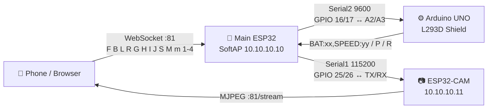
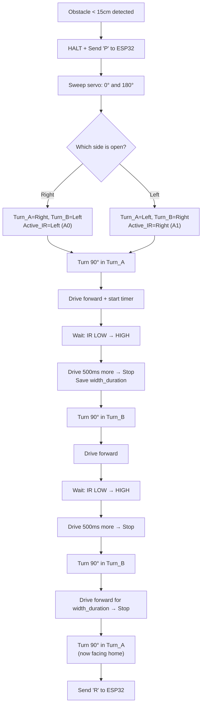

# Jai RC Rover — Return-to-Home Project Walkthrough
**Project by Jai Nitin**

---

## Files Created

| File | Location | Target MCU |
|------|----------|------------|
| [Main_ESP32.ino](file:///c:/JAI NIITIN MAYUR M/EFC/AG Codin/Main_ESP32/Main_ESP32.ino) | `Main_ESP32/` | ESP32 DevKit |
| [index.h](file:///c:/JAI NIITIN MAYUR M/EFC/AG Codin/Main_ESP32/index.h) | `Main_ESP32/` | (included by ESP32) |
| [Arduino_Controller.ino](file:///c:/JAI NIITIN MAYUR M/EFC/AG Codin/Arduino_Controller/Arduino_Controller.ino) | `Arduino_Controller/` | Arduino UNO |

---

## Architecture Overview



---

## Wiring Quick Reference

### Arduino L293D Shield (A0-A5 Block)

| Pin | Function | Wire To |
|-----|----------|---------|
| A0 | Left IR sensor signal | IR module OUT |
| A1 | Right IR sensor signal | IR module OUT |
| A2 | SoftwareSerial RX | ESP32 GPIO 17 (TX2) |
| A3 | SoftwareSerial TX | ESP32 GPIO 16 (RX2) |
| A4 | HC-SR04 TRIG | Ultrasonic TRIG |
| A5 | HC-SR04 ECHO | Ultrasonic ECHO |
| GND | Common Ground | ESP32 GND, CAM GND |

### Motor Mapping

| Shield Port | Position | AFMotor Object |
|-------------|----------|----------------|
| M1 | Front-Right | `mFR(1)` |
| M2 | Front-Left | `mFL(2)` |
| M3 | Back-Left | `mBL(3)` |
| M4 | Back-Right | `mBR(4)` |
| SERVO_1 | Ultrasonic sweep | Pin 10 |

### Main ESP32 Pins

| GPIO | Function | Wire To |
|------|----------|---------|
| 16 (RX2) | Serial2 RX | Arduino A3 |
| 17 (TX2) | Serial2 TX | Arduino A2 |
| 25 (RX1) | Serial1 RX | CAM TX (GPIO 1) |
| 26 (TX1) | Serial1 TX | CAM RX (GPIO 3) |

### Power

| Component | Source |
|-----------|--------|
| Arduino + Motors | 7.4V 18650 pack → L293D `EXT_PWR` |
| Main ESP32 | 5V USB power bank |
| ESP32-CAM | 5V USB power bank |
| **Common GND** | Physical wire linking all three GNDs |

---

## Command Protocol

### UI → ESP32 → Arduino

| Char | Action |
|------|--------|
| `F` | Forward |
| `B` | Backward |
| `L` | Spin Left |
| `R` | Spin Right |
| `G` | Forward-Left (diagonal) |
| `H` | Forward-Right (diagonal) |
| `I` | Backward-Left (diagonal) |
| `J` | Backward-Right (diagonal) |
| `S` | Stop / Heartbeat |
| `1`-`4` | Speed preset (100/150/200/255) |
| `M` | Activate RTH |
| `m` | Cancel RTH |

### ESP32 → Arduino (Internal)

| Char | Meaning |
|------|---------|
| `T` | RTH mode ON (enable ultrasonic scanning) |
| `t` | RTH mode OFF |

### Arduino → ESP32 → WebSocket

| Message | Meaning |
|---------|---------|
| `BAT:100,SPEED:78` | Periodic telemetry (every 500ms) |
| `P` | Pause RTH timer (obstacle detected) |
| `R` | Resume RTH timer (detour complete) |

### ESP32 → WebSocket (Status)

| Message | Meaning |
|---------|---------|
| `MODE:RTH` | Entered RTH mode |
| `MODE:MANUAL` | Returned to manual |
| `RTH:COMPLETE` | Home reached |
| `CAM:...` | Forwarded camera telemetry |

---

## RTH Direction Inversion Map

| Original | Inverted |
|----------|----------|
| `F` ↔ `B` | Forward ↔ Backward |
| `L` ↔ `R` | Left ↔ Right |
| `G` ↔ `J` | Fwd-Left ↔ Bwd-Right |
| `H` ↔ `I` | Fwd-Right ↔ Bwd-Left |

---

## Active Detour Sequence (Arduino)



---

## ESP32-CAM Configuration Guide

> [!IMPORTANT]
> The ESP32-CAM runs its own sketch separately. It connects to the rover's SoftAP as a **station client** and serves an MJPEG stream that the Web UI pulls directly.

### Recommended Sketch

Use the **CameraWebServer** example from the ESP32 Arduino core (File → Examples → ESP32 → Camera → CameraWebServer), modified as follows:

```diff
 // Wi-Fi credentials — connect to the rover's AP
-const char* ssid     = "your-ssid";
-const char* password = "your-password";
+const char* ssid     = "Jai_RC_Rover";
+const char* password = "";               // open network

 // Static IP on the rover's subnet
+#include <WiFi.h>
+IPAddress local_IP(10, 10, 10, 11);
+IPAddress gateway(10, 10, 10, 1);
+IPAddress subnet(255, 255, 255, 0);

 void setup() {
   Serial.begin(115200);
+  WiFi.config(local_IP, gateway, subnet);
   WiFi.begin(ssid, password);
   // ... rest of camera init
 }
```

### Key Settings

| Parameter | Value |
|-----------|-------|
| Board | AI-Thinker ESP32-CAM |
| Wi-Fi Mode | `WIFI_STA` (station) |
| Static IP | `10.10.10.11` |
| MJPEG Stream Port | `81` (default for CameraWebServer) |
| Stream URL | `http://10.10.10.11:81/stream` |
| Resolution | `FRAMESIZE_VGA` or `FRAMESIZE_QVGA` (balance quality vs. latency) |
| Serial TX | GPIO 1 → Main ESP32 GPIO 25 (for text telemetry, optional) |
| Serial RX | GPIO 3 → Main ESP32 GPIO 26 (for receiving commands, optional) |
| Serial Baud | `115200` |

### Optional Serial Telemetry

If you want the CAM to send data (e.g., detection results) to the Web UI:
```cpp
// In the CAM sketch, simply print to Serial:
Serial.println("DETECT:person");
// The Main ESP32 picks this up on Serial1 and broadcasts as "CAM:DETECT:person"
```

---

## Required Libraries

### Main ESP32 (Arduino IDE)

| Library | Author | Install From |
|---------|--------|-------------|
| WebSockets | Markus Sattler | Library Manager: search "WebSockets" |
| WiFi, WebServer | Espressif | Built-in with ESP32 core |

### Arduino UNO

| Library | Author | Install From |
|---------|--------|-------------|
| Adafruit Motor Shield V1 | Adafruit | Library Manager: search "Adafruit Motor Shield library" (the **V1** legacy version, NOT V2) |
| Servo | Arduino | Built-in |
| SoftwareSerial | Arduino | Built-in |

> [!WARNING]
> Make sure to install the **V1** Adafruit Motor Shield library (`AFMotor.h`), NOT the V2 (`Adafruit_MotorShield.h`). They are different libraries for different hardware.

---

## Calibration Notes

> [!TIP]
> These constants in [Arduino_Controller.ino](file:///c:/JAI NIITIN MAYUR M/EFC/AG Codin/Arduino_Controller/Arduino_Controller.ino) will need tuning for your specific chassis:

| Constant | Default | Purpose |
|----------|---------|---------|
| `TURN_90_MS` | 420 ms | Duration of a 90° spin turn. Place rover on ground, trigger a spin, and time it. |
| `OBSTACLE_CM` | 15 cm | Ultrasonic trigger distance for detour. |
| `POST_CLEAR` | 500 ms | Extra forward drive after IR clears the obstacle edge. |
| `IR_TIMEOUT` | 12000 ms | Max wait time for IR state change before aborting. |

### How to Calibrate `TURN_90_MS`
1. Upload the sketch to the Arduino
2. Connect via serial monitor at 9600 baud
3. Send `R` (spin right) manually, time how long a 360° spin takes
4. Divide by 4 → that's your 90° value
5. Update `TURN_90_MS` and re-upload

---

## Web UI Features

The control panel served at `http://10.10.10.10` includes:

- **Live camera feed** — MJPEG stream from ESP32-CAM with auto-retry
- **Dual touch joysticks** — Left (Drive Y-axis), Right (Steer X-axis)
- **Diagonal command mapping** — Combined joystick inputs produce G/H/I/J
- **Speed selector** — 4 speed presets with visual feedback
- **RTH toggle** — Sends `M`/`m`, pulses red when active
- **Telemetry display** — Battery % and speed % updated in real-time
- **Connection status** — Live dot indicator + auto-reconnect (1.5s)
- **100ms heartbeat** — Sends current command as keep-alive
- **Dark glassmorphic design** — Premium UI with glow effects and animations
